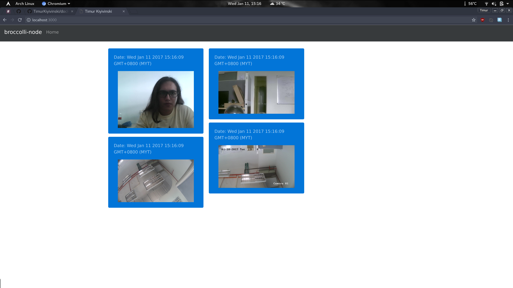

# broccolli-node
Simple technology preview of proprietary Broccolli application developed for [SAINS](http://sains.com.my/) alongside [Swinburne Sarawak](http://www.swinburne.edu.my/). Broccolli is a distributed ONVIF-compliant video surveillance solution. This prototype shows how the backend makes use FFMPEG to stream video frames to clients over a websocket.

## usage
Copy `env.json.example` to `env.json` and modify the stream addresses accordingly. Next, run `npm install` and `npm start` to get the application running. The default address should be `http://localhost:3000/`.

## preview

